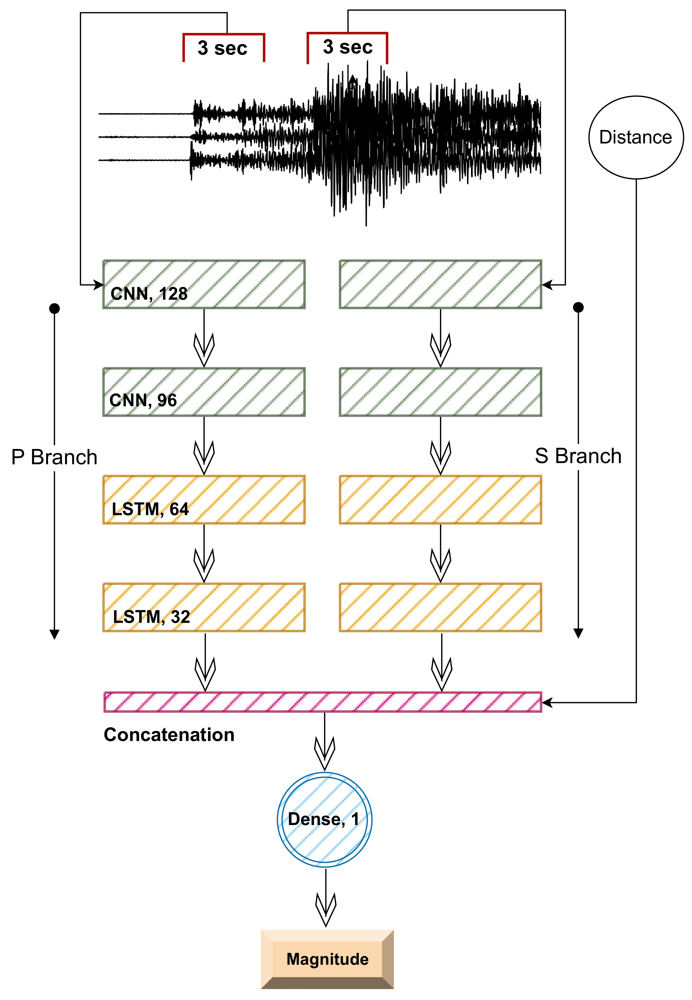
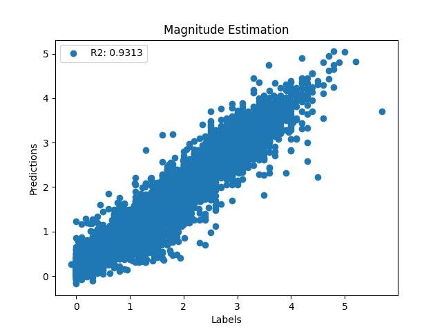
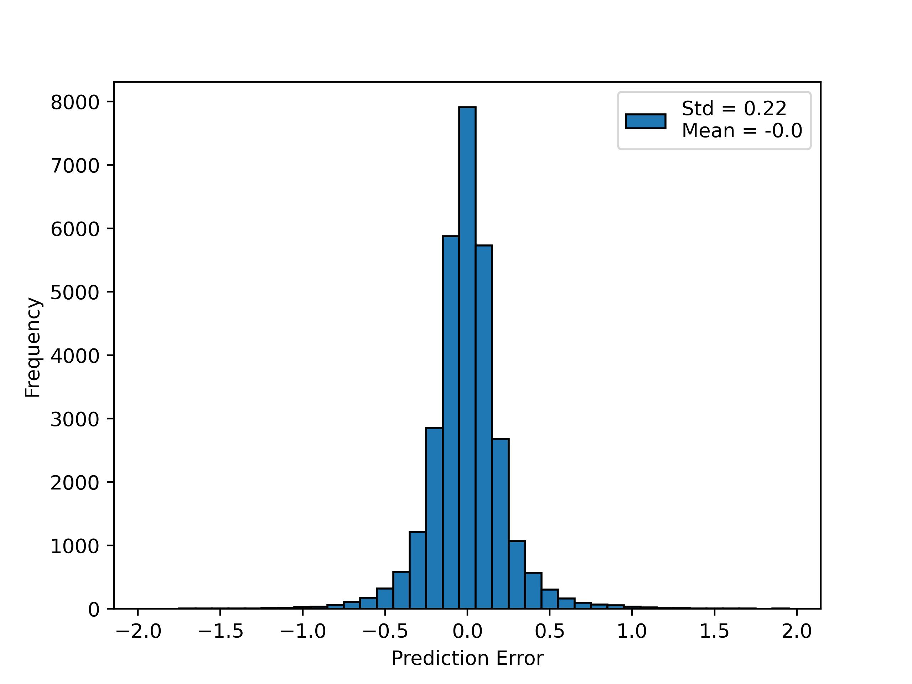

# EqShake
A Deep-Learning Model For Earthquake Magnitude Estimation

The accurate estimation of earthquake magnitude is crucial for assessing seismic hazards and ensuring effective disaster mitigation strategies. EqShake is a deep-learning model for accurate earthquake magnitude estimation utilizing single-station raw waveforms. EqShake, as opposed to other available models, is designed to be independent of event-station distance.

  

  

  

